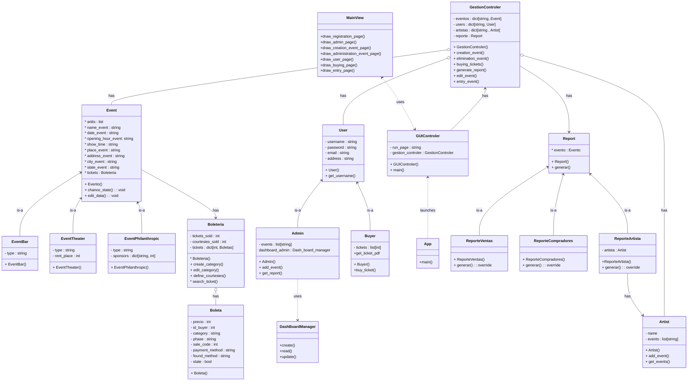

# GestionBoletasComedia

# Diagrama de Clases

```mermaid
classDiagram
    class Event {
        * artits : list<string>
        * name_event : string
        * date_event : string
        * opening_hour_event: string
        * show_time : string
        * place_event : string
        * address_event : string
        * city_event : string
        * state_event : string
        * tickets : Boleteria
        + Evento()
        + chance_state() : void
        + edit_data() : void
    }

    class EventBar  {
        - type : string
        + EventBar()
    }

    class EventTheater {
        - type : string
        - rent_place : int
        + EventTheater()
    }

    class EventPhilanthropic {
        - type : string
        - sponsors : dict[string, int]
        + EventPhilanthropic()
    }

    class Boleteria {
        - tickets_sold : int
        - courtesies_sold : int
        - tickets : dict[int, Boletas]
        * Boleteria()
        + create_category()
        + edit_category()
        + define_courtesies()
        * search_ticket()
    }

    class Boleta {
        - precio : int
        - id_buyer : int
        - category : string
        - phase : string
        - sale_code : int
        - payment_method : string
        - found_method : string
        - state : bool
        + Boleta()
    }

    class DashBoardManager {
        +create()
        +read()
        +update()
    }
    
    class Artist {
        - name
        - events : list[string]
        + Artist()
        + add_event()
        + get_events()
    }
    class User {
        - username : string
        - password : string
        - email : string
        - address : string
        + User()
        + get_username()
    }

    class Admin {
        - events : list[string]
        dashboard_admin : Dash_board_manager
        + Admin()
        + add_event()
        + get_report()
    }
    class Buyer {
        - tickets : list[int]
        + Buyer()
        +buy_ticket()
        +get_ticket_pdf
    }

    class MainView {
        +draw_registration_page()
        +draw_admin_page()
        +draw_creation_event_page()
        +draw_administration_event_page()
        +draw_user_page()
        +draw_buying_page()
        +draw_entry_page()
    }

    class App {
        +main()
    }

    class GUIControler {
        - run_page : string
        - gestion_controler : GestionControler
        + GUIControler()
        + main()
    }

    class GestionControler {
        - eventos : dict[string, Event]
        - users : dict[string, User]
        - artistas : dict[string , Artist]
        - reporte : Report
        + GestionControler()
        + creation_event()
        + elimination_event()
        + buying_tickets()
        + generate_report()
        + edit_event()
        + entry_event()
    }

    class Report {
        * evento : Evento
        + Report()
        + generar()
    }

    class ReporteVentas {
        + ReporteVentas()
        + generar() : override
    }

    class ReporteCompradores {
        + ReporteCompradores()
        + generar() : override
    }

    class ReporteArtista {
        +ReporteArtista()
        - artista : Artist
        + generar() : override
    }

    GUIControler <.. App : launches
    Event <-- EventBar : is-a
    Event <-- EventTheater : is-a
    Event <-- EventPhilanthropic : is-a
    GestionControler <-- GUIControler : has
    MainView <..> GUIControler : uses
    GestionControler o-- Event : has
    GestionControler o-- User : has
    GestionControler o-- Artist : has
    GestionControler --> Report : has
    Report <-- ReporteVentas : is-a
    Report <-- ReporteCompradores : is-a
    Report <-- ReporteArtista : is-a
    Event --> Boleteria : has
    Boleteria o-- Boleta : has
    ReporteArtista --> Artist : has
    User <-- Admin : is-a
    User <-- Buyer : is-a
    Admin ..> DashBoardManager : uses
    
     
```